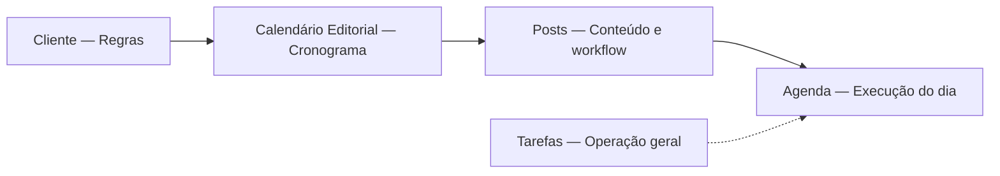

# Auditoria UX — Calendário Editorial como centro de planejamento

**Data:** junho/2026  
**Escopo:** análise crítica do fluxo Cliente → Calendário Editorial → Posts → Agenda  
**Tipo:** auditoria funcional/UX — **sem implementação**  
**Base:** código em `master` / branch `fix/mvp-calendar-operational-milestones-ux` (fases 5, 5.1, 5.2 UX)

**Referências cruzadas:**  
`docs/AUDIT-MVP-PHASE5-PLANNING-CALENDAR-POSTS.md`, `docs/MVP-INTELLIGENCE-RULES.md`, `docs/MVP-DIAGNOSTICO-BASE.md`, `docs/HANDOFF-CONTEXTO-PROJETO.md`

---

## Resumo executivo

O produto **já possui** a espinha dorsal correta: regras no cliente, cronograma no Calendário Editorial (previsões + datas), produção no Kanban de Posts, execução temporal na Agenda. O modelo unificado `Task` (previsão ↔ post real) suporta bem esse fluxo.

A confusão atual **não vem de ausência de funcionalidade**, e sim de **múltiplos pontos de entrada** para as mesmas ações, **duas “telas de calendário”** (Editorial vs Agenda) e **camadas de monitoramento** (KPIs + Central) que competem com a pergunta principal do Calendário: *“Em quais dias vamos publicar?”*

**Veredicto:** o Calendário Editorial **pode** ser a tela principal de planejamento operacional, mas **ainda não se comporta como tal na UX** — parece um “hub híbrido” (planejar + monitorar + atalhar para Posts). Com simplificação e um fluxo guiado *Planejar cliente*, a arquitetura atual **suporta** a visão de produto sem reescrever backend.

---

## Mapa mental desejado vs implementado

| Camada | Pergunta que responde | Onde vive hoje | Alinhamento |
|--------|----------------------|----------------|-------------|
| **Regras** | “Qual é o combinado ideal?” | Cliente → aba **Planejamento** (`PlanningSectionEditor`) + Estratégia | ✅ Forte |
| **Cronograma** | “Em quais dias publicamos?” | **Calendário Editorial** (`PlanningPage`) | ⚠️ Parcial |
| **Conteúdo** | “O que será publicado?” | **Posts** (`ProducaoPage` + modal) | ✅ Forte |
| **Execução** | “O que fazer agora?” | **Agenda** + Tarefas | ✅ Forte (com sobreposição de datas) |

**Distinção crítica já existente no código:** a aba **Planejamento do cliente** (cadastro) ≠ página **Calendário Editorial** (`page: planejamento`, label `editorial_calendar`). Essa separação é correta, mas **não está suficientemente explicitada** para o usuário final.

---

## 1. Responsabilidades sobrepostas

### 1.1 Calendário Editorial × Posts

| Tema | Calendário | Posts | Sobreposição |
|------|------------|-------|--------------|
| Criar post real | Modal (`PostOrForecastModal`, nature post/forecast) | Modal (`initialNature` post) | **Alta** — dois caminhos para o mesmo `POST /tasks` |
| Converter previsão → post | Sim (modal + API `convertForecastWithCreatePayload`) | Sim (criação no mesmo dia consome previsão) | **Intencional** — OK se Calendário for dono do cronograma |
| Editar título/data/status | Sim (modal) | Sim (modal + Kanban) | **Alta** — produção deveria concentrar-se em Posts |
| Ver status de produção | Borda colorida na grade semanal | Kanban completo + `PostActions` | **Média** — preview no calendário é útil; ações completas são redundantes |
| Navegação | `openTaskInPostsPage` + localStorage | Destino | **Baixa** — ponte correta |

**Código:** `PlanningPage.tsx` (modal, `handleSaveFromModal`), `ProducaoPage.tsx` (`isRealPostFlowTask`, Kanban), `PostOrForecastModal.tsx` (compartilhado).

### 1.2 Calendário Editorial × Agenda

| Tema | Calendário | Agenda | Sobreposição |
|------|------------|--------|--------------|
| Ver posts por data | Grade semanal + heatmap mensal | Grade diária/semanal/mensal | **Alta** — duas visões temporais |
| Ver previsões | Sim (badge/tracejado) | Sim (badge PREVISÃO) | **Alta** — mesma informação em dois lugares |
| Criar post | Sim | Sim (`initialNature="post"`) | **Alta** — Agenda não cria previsão por padrão, mas cria post |
| Reagendar (drag) | Não | Sim | **Baixa** — papel da Agenda |
| Tarefas gerais | Não | Sim | **Nenhuma** — correto |
| Quota / meta | `planningQuota`, `onValidateForecast` | `createPlanningQuotaValidator` | **Média** — mesma regra, dois pontos de validação |
| Central Inteligente | `buildPlanningIntelligenceItems` | `buildAgendaIntelligenceItems` | **Média** — insights relacionados em escopos diferentes |

**Código:** `AgendaPage.tsx` (`agendaCellDayKey` = `publishDate`), `lib/agendaVisibleSummary.ts`, `PlanningPage.tsx`.

### 1.3 Planejamento (cliente) × Calendário Editorial

| Tema | Cliente (regras) | Calendário | Sobreposição |
|------|------------------|------------|--------------|
| Frequência, dias preferidos | Formulário | Interpretação (`getExpectedForWeek`, slots fantasma) | **Nenhuma** — relação correta regra → aplicação |
| Offsets produção/aprovação | Formulário | **Planejamento recomendado** só no modal | **Baixa** — bem separado após fase 5.2 UX |
| Gerar previsões em lote | — | Header “Gerar previsões” | **Nenhuma** — ação operacional no lugar certo |
| KPIs gap/meta | — | Cards + Central | **Média** — monitoramento poderia ser secundário |

**Código:** `PlanningSectionEditor.tsx`, `lib/clientContext.ts`, `lib/operationalMilestones.ts`.

### 1.4 Dashboard × Calendário (satélite)

O Dashboard delega insights de planejamento à mesma família `buildPlanningIntelligenceItems` (`computeDashboardOperationalInsights`). Isso **duplica** mensagens que o usuário também vê no Calendário.

---

## 2. O Calendário Editorial já é a tela principal de planejamento?

### Resposta: **parcialmente — ainda não na prática**

### O que já sustenta esse papel

- Grade **semanal por cliente** alinhada ao subtítulo oficial (*“Planeje o calendário semanal por cliente…”*).
- **Previsões** persistidas + slots visuais em dias preferenciais (semana).
- **Geração em lote** (`computeForecastDatesToCreate`) atrelada à frequência do cliente.
- **Quota unificada** (`lib/planningQuota.ts`) e insights de gap/excesso/concentração.
- Conversão previsão → post **in-place** (mesmo `Task.id`).
- Filtro por cliente e navegação para semana a partir do mês.
- Permissão de módulo `planning` separada de `posts`.

### O que falta para ser “principal” de forma clara

| Lacuna | Impacto |
|--------|---------|
| **Entrada principal ambígua** | Sidebar: Clientes → Calendário → Posts. Falta um CTA único “Planejar cliente” e copy que diga: *primeiro monte o cronograma aqui*. |
| **Duas vistas competindo** | Mensal (heatmap) abre por padrão; operação real é semanal. Usuário pode ficar no “resumo” sem montar grade. |
| **Monitoramento pesa na mesma tela** | KPIs (4 cards) + Central Inteligente + insights agregados competem com a grade. |
| **Agenda espelha o plano** | Previsões e posts aparecem de novo na Agenda — usuário não sabe qual calendário “manda”. |
| **Posts contorna o plano** | Criar post direto em Posts/Agenda sem passar pelo calendário não é impedido (nem deveria ser bloqueado, mas falta orientação). |
| **Sem estado “planejamento confirmado”** | Não há marco de “cronograma fechado para o período”; tudo é fluido. |
| **Ligação fraca com cadastro** | Ajustar frequência exige ir ao Cliente; Calendário só avisa via tooltip/insights. |

### O que sobra (ruído)

- **Central Inteligente completa** na mesma dobra que a grade (12+ tipos de insight possíveis agregados).
- **KPIs mensais e semanais** trocando com a vista — informação densa para quem só quer alocar datas.
- **Botões múltiplos no modal do dia** (editar, converter, ir para Posts, abrir semana) sem hierarquia clara.
- **Slots fantasma** (dia preferencial sem previsão) na semana — úteis, mas parecem “obrigatórios” sem legenda forte.

### O que deveria sair ou ser rebaixado (UX, não código nesta auditoria)

| Elemento | Recomendação |
|----------|--------------|
| Central no Calendário | **Simplificar** — 2–3 insights acionáveis + link “ver todos no Dashboard” |
| KPIs | **Simplificar** — 1–2 números-chave; detalhe sob demanda |
| Ações de produção no modal do Calendário | **Manter editar previsão**; **mover** produção pesada para Posts |
| Heatmap mensal como default | **Simplificar** — default semanal para operação; mensal como “mapa” |
| Previsões na Agenda | **Manter** (execução), mas **visual secundário** — não editar cronograma na Agenda |

---

## 3. Fluxo ideal proposto

### Fluxo principal (recomendado)



**Passo a passo para o usuário:**

1. **Cliente** — Define frequência, dias preferidos, offsets, responsáveis (*“combinado ideal”*).
2. **Calendário Editorial** — Monta o período: previsões + datas + ajustes de lacunas/excessos (*“em quais dias”*).
3. **Posts** — Preenche pauta, produz, aprova, agenda publicação (*“o quê”*).
4. **Agenda** — Acompanha o que vence hoje/atrasos; reagenda se necessário (*“agora”*).
5. **Tarefas** — Paralelo para operação não-post (reuniões, financeiro, etc.).

### Fluxos secundários (permitidos, mas não centrais)

- **Post urgente** criado em Posts ou Agenda → consome previsão do dia se existir (API já faz).
- **Dashboard** → visão gerencial agregada, não substituto do Calendário.
- **Tarefas** → nunca competem com cronograma de post.

### Ordem de sidebar (atual)

`Clientes → Calendário Editorial → Posts → Tarefas → Agenda`

**Avaliação:** ordem **coerente** com o fluxo. Opcional futuro: renomear/reforçar tooltips para distinguir “Planejamento do cliente” (cadastro) vs “Calendário Editorial” (cronograma).

---

## 4. Avaliação — fluxo guiado “Planejar cliente”

### Proposta

Botão principal **“Planejar cliente”** → wizard:

1. Escolher cliente  
2. Mostrar frequência e dias sugeridos  
3. Mostrar lacunas e excessos  
4. Usuário ajusta na grade  
5. Confirma planejamento  

Depois: Posts e Agenda apenas executam.

### Faz sentido na arquitetura atual?

**Sim — alta aderência, baixo risco de backend no MVP do wizard.**

| Capacidade necessária | Já existe? | Onde |
|----------------------|------------|------|
| Ler frequência/dias | ✅ | `brandGuideJson`, `getClientPlanningProfile` |
| Sugerir datas em lote | ✅ | `computeForecastDatesToCreate`, `handleGenerateForecasts` |
| Detectar lacunas/excessos | ✅ | `buildPlanningIntelligenceItems`, `weekSummary`, quota |
| Ajuste manual | ✅ | Grade semanal + modal |
| Persistir previsões | ✅ | `POST /tasks` category `forecast` |
| Converter para posts depois | ✅ | API + modal |

| Gap para wizard completo | Esforço |
|--------------------------|---------|
| UI wizard (steps) | Frontend — médio |
| Estado “período confirmado” | Opcional — schema novo ou flag em memória/local |
| Bloquear criação fora do plano | **Não recomendado** — só orientação |
| Deep link Cliente ↔ Calendário | Frontend — baixo |
| Unificar “Gerar previsões” dentro do wizard | UX — reorganização |

### Riscos da abordagem

- **Duplicar** o que “Gerar previsões” já faz sem narrativa clara → wizard deve **substituir mentalmente** o botão atual, não somar.
- **Confirmar planejamento** sem artefato persistido pode frustrar → considerar snapshot leve (ex.: `planningConfirmedUntil` por cliente/período) em fase 2.
- Wizard só com um cliente por vez está alinhado ao código (`canGenerateForecasts` exige filtro ≠ `all`).

### Recomendação

**Aprovar conceito.** Implementar como **camada UX sobre** `PlanningPage` (modal ou steps inline), reutilizando `computeForecastDatesToCreate` e insights existentes — **sem** nova engine.

---

## 5. Elementos do Calendário Editorial — classificação

Legenda: **Manter** · **Simplificar** · **Mover** · **Remover**

| Elemento | Classificação | Justificativa |
|----------|---------------|---------------|
| Grade semanal cliente × dias | **Manter** | Núcleo do cronograma |
| Heatmap mensal | **Simplificar** | Útil como mapa; não como tela default operacional |
| Previsões (registros) | **Manter** | Definição do cronograma |
| Posts reais na grade | **Manter** | Feedback do que já saiu do plano |
| Slots fantasma (dia preferencial) | **Simplificar** | Legenda + tooltip; evitar parecer “slot vazio obrigatório” |
| Gerar previsões (header) | **Simplificar** | Absorver no fluxo “Planejar cliente” |
| Botão + (criar slot) | **Manter** | Ação granular necessária |
| KPIs (4 cards) | **Simplificar** | Reduzir a 1–2 métricas contextuais |
| Central Inteligente (carrossel) | **Simplificar** | Menos itens; insights operacionais de marco → futuro, não no calendário |
| Filtro cliente | **Manter** | Essencial |
| Mensal / Semanal toggle | **Manter** | Com default **semanal** para operação |
| Modal dia (agrupado por cliente) | **Manter** | Melhorado recentemente; manter evolução |
| Planejamento recomendado (modal) | **Manter** | Regras do cliente → datas ideais; lugar certo |
| Tooltips Posts/Previsões no mês | **Manter** | Contexto sem poluir célula |
| Marcação “hoje” | **Manter** | Consistente com Agenda |
| Ir para Posts / abrir semana (modal) | **Simplificar** | Uma ação primária + secundária |
| Editar post real no Calendário | **Mover** | Preferir “Abrir em Posts” como caminho principal |
| Central de insights agregados estilo Dashboard | **Mover** | Dashboard ou drawer lateral |
| Copy/subtítulo da página | **Simplificar** | Reforçar: *“Monte aqui o cronograma de publicação”* |

---

## 6. Matriz de responsabilidades alvo (TO-BE)

| Ação | Dono principal | Secundário permitido |
|------|----------------|----------------------|
| Definir frequência e offsets | Cliente (cadastro) | — |
| Alocar datas (previsões) | **Calendário Editorial** | Wizard “Planejar cliente” |
| Ajustar lacunas/excessos | **Calendário Editorial** | Central (só alerta) |
| Criar/editar conteúdo de post | **Posts** | Modal rápido no Calendário (previsão) |
| Mudar status produção/aprovação | **Posts** | Agenda (card actions) |
| Reagendar data publicada | **Agenda** (drag) | Modal Posts |
| Ver “o que fazer hoje” | **Agenda** | — |
| Tarefas operacionais gerais | **Tarefas** | Agenda |
| Métricas gerenciais agência | **Dashboard** | — |

---

## 7. Proposta de fluxo final do produto (para aprovação)

### Princípios

1. **Uma pergunta por tela** — regras / cronograma / conteúdo / execução.  
2. **Calendário Editorial = dono do cronograma** — previsões nascem e se ajustam prioritariamente aqui.  
3. **Posts = dono do workflow de conteúdo** — Kanban e ações lineares.  
4. **Agenda = dono do tempo presente** — hoje, atrasos, reagendamento; espelha plano, não o substitui.  
5. **Monitoramento pesado** → Dashboard ou painel colapsável, não competir com a grade.

### Jornada tipo (nova conta de cliente)

```
1. Cadastrar cliente
2. Preencher Planejamento (frequência, dias, offsets)     [Cliente]
3. Clicar "Planejar cliente" no Calendário                  [Calendário]
   → ver sugestões → gerar previsões → ajustar semana → confirmar
4. Ir para Posts quando iniciar produção                    [Posts]
5. Usar Agenda no dia a dia                                 [Agenda]
```

### Mudanças UX priorizadas (roadmap sugerido — pós-aprovação)

| Prioridade | Entrega | Impacto |
|------------|---------|---------|
| P0 | Fluxo guiado **Planejar cliente** (wizard) | Clareza de papel do Calendário |
| P0 | Default **semanal** + copy da página | Reduz confusão mensal vs operação |
| P1 | Enxugar KPIs + Central no Calendário | Menos ruído visual |
| P1 | Hierarquizar modal do dia (1 CTA principal) | Menos paralelismo com Posts |
| P2 | Deep links Cliente ↔ Calendário filtrado | Fecha loop regras → cronograma |
| P2 | Agenda: previsões visíveis mas **sem** criar cronograma | Papéis mais claros |
| P3 | Estado opcional “período confirmado” | Governança para equipes maiores |

### O que **não** mudar (restrições alinhadas ao MVP)

- Modelo `Task` único e conversão previsão → post na API.  
- Quota / `planningQuota.ts`.  
- Permissões por módulo (`planning` vs `posts` vs `agenda`).  
- Central Inteligente como engine (só **onde** exibir insights).  
- Backend de geração/consumo de previsão.

---

## 8. Conclusão

A arquitetura funcional **suporta** a visão de produto desejada. A sobreposição percebida vem principalmente de:

- **Dupla visualização temporal** (Calendário Editorial + Agenda).  
- **Múltiplos pontos de criação** de post.  
- **Monitoramento (KPIs + Central)** no mesmo nível hierárquico da grade de planejamento.  
- **Falta de um ritual claro** (“Planejar cliente”) que amarre regras → previsões → execução.

**Recomendação final:** aprovar o fluxo **Cliente → Calendário → Posts → Agenda**, investir primeiro no **wizard Planejar cliente** e na **simplificação visual do Calendário** (não em mover lógica para outras páginas ou reescrever backend).

---

## Anexo — arquivos analisados

| Área | Arquivos principais |
|------|---------------------|
| Calendário | `components/PlanningPage.tsx`, `lib/planningQuota.ts`, `lib/planningCentralView.ts` |
| Modal compartilhado | `components/PostOrForecastModal.tsx`, `lib/operationalMilestones.ts` |
| Posts | `components/ProducaoPage.tsx`, `lib/taskActionFlow.ts` |
| Agenda | `components/AgendaPage.tsx`, `lib/agendaVisibleSummary.ts`, `lib/agendaViewMode.ts` |
| Regras cliente | `components/clients/sectionEditors/PlanningSectionEditor.tsx`, `lib/clientContext.ts` |
| Central | `lib/intelligentCentral.ts`, `components/IntelligentCentral.tsx` |
| API | `apps/api/src/tasks/tasks.service.ts` |
| Navegação | `components/Sidebar.tsx`, `App.tsx` |

---

*Documento gerado para decisão de produto antes de nova implementação. Nenhum código de aplicação foi alterado nesta auditoria.*
