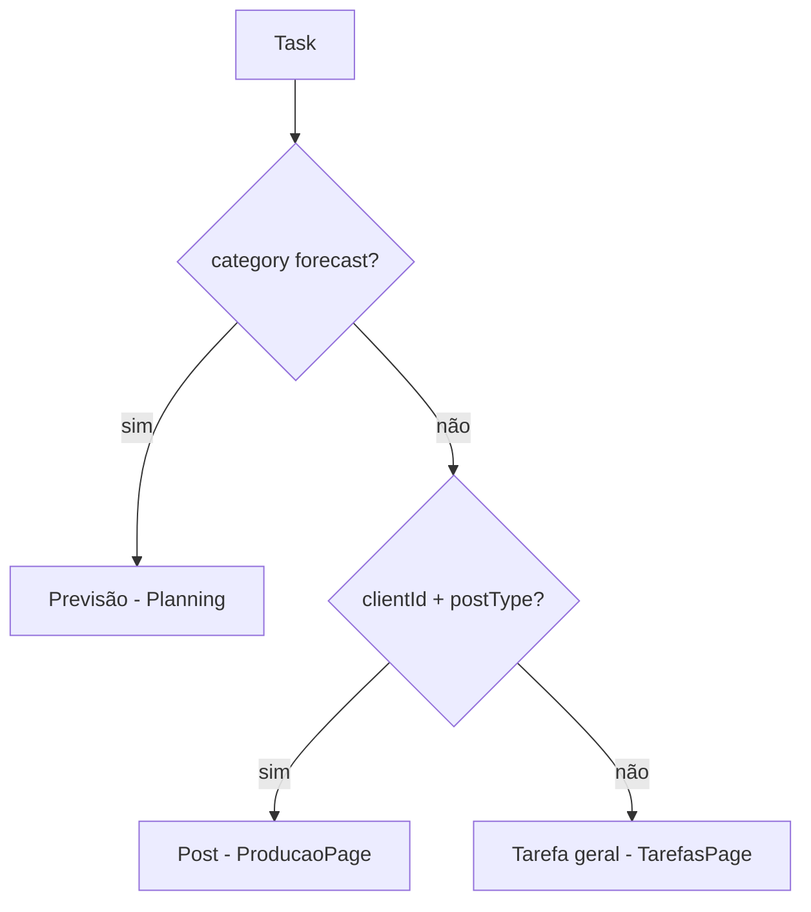

# MVP — Diagnóstico e base real do sistema

**Branch:** `feature/mvp-diagnostico-base`  
**Data:** 2026-05-20  
**Objetivo:** Fotografia do estado atual antes de novas implementações — evitar recriar funcionalidades, sobrescrever regras ou gerar retrabalho.

> **Escopo desta etapa:** apenas diagnóstico. Nenhuma feature nova foi implementada neste documento.

---

## Resumo executivo

O Flow ERP unifica **posts**, **previsões** e **tarefas gerais** no modelo `Task` (Prisma). O fluxo operacional principal no frontend usa `PATCH /tasks/:id/status` com sub-etapas (`currentActionId`). A UI de Posts é `ProducaoPage.tsx` (rota `producao`); tarefas gerais em `TarefasPage.tsx`; previsões em `PlanningPage.tsx`; visão calendário em `AgendaPage.tsx`.

**Pontos fortes:** CRUD completo de posts/tarefas, Kanban, Agenda/Planejamento integrados por API, módulo de clientes maduro (estratégia, pilares, frequência), SOLO/TEAM com autoatribuição e sugestões de responsável, visual diferenciado de cards na Agenda.

**Principais lacunas:** endpoints legados `post-action` sem uso no UI; agendamento sem plataforma persistida de forma estruturada; `SchedulePostModal` órfão; responsáveis por etapa sem UI; dashboard API parcialmente desalinhada; alguns campos de agência sem efeito na cadeia de fallback.

---

## Arquitetura encontrada

| Camada | Tecnologia | Observação |
|--------|------------|------------|
| Frontend | React + Vite + TypeScript | Navegação por `page` em `App.tsx` + rotas `/clientes/*` |
| API | NestJS (`apps/api`) | Módulos: tasks, clients, dashboard, workflows, agencies, financial, etc. |
| Dados | Prisma + PostgreSQL | `Task` único para post/previsão/tarefa geral |
| Auth | JWT + guards de role/módulo | `resolveUserModuleAccess.ts`, `task-module-access.ts` |
| i18n | `lib/i18n.ts` | pt / en / es |
| Cores/status | `lib/statusColors.ts`, `lib/colorSchemes.ts` | Workflows seed + prefs da agência |

### Rotas principais (`App.tsx` + `Sidebar.tsx`)

| Página | `page` | Permissão típica |
|--------|--------|------------------|
| Dashboard | `dashboard` | `view_dashboard` (oculto para perfil operacional) |
| Posts | `producao` | `view_agenda` |
| Agenda | `agenda` | `view_agenda` |
| Tarefas | `tarefas` | `view_agenda` |
| Planejamento | `planejamento` | `view_agenda` (+ módulo `planning`) |
| Clientes | `clients` | `view_clients` / `manage_clients` |
| Financeiro | `finance` | `view_finance` |
| Configurações | `settings` | módulo `settings` |

### Modelo `Task` (distinção operacional)

| Tipo | Critério | Workflow | UI principal |
|------|----------|----------|--------------|
| Post real | `clientId` + `postType` | `client` (6 status) | `ProducaoPage`, `PostActions` |
| Previsão | `category: forecast` | cliente / forecast | `PlanningPage`, `PostOrForecastModal` |
| Tarefa geral | sem `postType` | `general` (3 status) | `TarefasPage`, `GeneralTaskActions` |

**Arquivos centrais:** `prisma/schema.prisma`, `lib/mapApiTaskToTask.ts`, `apps/api/src/tasks/tasks.service.ts`, `lib/taskActionFlow.ts`.

---

## Regras atuais (não sobrescrever sem decisão explícita)

1. **Transição de status de post:** UI usa fluxo linear via `PATCH /tasks/:id/status` + `currentActionId` (`POST_CLIENT_LINEAR_FLOW`). Endpoints `POST /tasks/:id/post-action` existem na API mas **não são chamados pelo frontend**.
2. **Status iniciais de post:** criação típica com `pauta_criada` / `criando_pauta` (modal + `ProducaoPage`).
3. **Agendado:** UI exige `publishDate` ao avançar para `agendado`; API legada `agendar_post` grava plataforma/data em `description` — caminho não usado pelo UI atual.
4. **SOLO (`Agency.mode`):** `ownerUserId` do post = usuário logado na criação.
5. **TEAM:** cadeia de fallback para `ownerUserId`: etapa → responsável do cliente → estratégia da agência → owner da agência (`client-owner.util.ts`). Sugestão após transição de etapa com prompt no UI.
6. **`operationMode` (solo / lean / structured):** distinto de SOLO/TEAM; governa painéis de responsável no cliente e `executionOwnerUserId` automático (desligado em `solo`).
7. **Responsável por etapa:** backend suporta `stageOwnerMap` se `allowStageOwners`; UI do cliente força `useDefaultOwnerForAllStages: true` — etapas individuais **não editáveis** na prática.
8. **Agenda:** cards com visual diferenciado POST/TAREFA/PREVISÃO (`lib/agendaViewMode.ts`) — padrão único, sem toggle.
9. **Permissões operacionais:** perfil operacional não altera `ownerUserId` no save e ignora prompt de sugestão de owner.
10. **Módulos:** posts reais → `posts`; tarefas gerais → `tasks`; forecast → `planning`; agenda → `agenda`.

---

## 1. Fluxo operacional — Posts

| Item | Status | Arquivos principais | Observações | Dependências | Riscos |
|------|--------|---------------------|-------------|--------------|--------|
| Criar post | **Concluído** | `ProducaoPage.tsx`, `PostOrForecastModal.tsx`, `tasks.service.ts` | `POST /tasks` | Workflow cliente, cliente, `postType` | Workflow custom sem IDs canônicos quebra fluxo linear |
| Editar post | **Concluído** | Modal + `PUT /tasks/:id` | Campos + seletor status/sub-etapa | — | — |
| Mudança de status (macro) | **Concluído** | `PATCH /tasks/:id/status`, Kanban drag | `changeSource`: `kanban_drag`, `quick_action` | `taskActionFlow.ts` | — |
| Sub-etapas (fluxo linear) | **Concluído** | `PostActions.tsx`, `currentActionId` | Menu prev/next agrupado | Status IDs canônicos | Degrada para só macro se workflow inválido |
| Aprovação (UI) | **Concluído** | Substatus `enviado_aprovacao`, `em_alteracao`, etc. | Via `/status`, não `/post-action` | — | — |
| Aprovação via `post-action` no UI | **Não implementado** | `tasks.controller.ts` | API `aprovar` / `pedir_ajuste` órfãs | — | Dupla implementação confunde manutenção |
| Agendamento | **Parcial** | `PostActions.tsx` | UI valida `publishDate`; sem plataforma estruturada | — | Dados de agendamento incompletos para MVP publicação |
| `SchedulePostModal` | **Não implementado** (integração) | `SchedulePostModal.tsx` | Componente existe, **sem import** em páginas | — | Retrabalho se criar modal novo |
| Publicação (`publicado`) | **Concluído** | Status + sub `publicado_final` | Via fluxo linear/Kanban | — | Sem integração rede social |
| Histórico de status | **Concluído** | `TaskStatusHistoryModal.tsx` | `GET /tasks/:id/status-history` | — | — |
| Previsão → post | **Concluído** | `PUT` + `convertedToPostAt` | `changeSource: convert_forecast` | Planning / modal | — |
| Sugestão de responsável | **Concluído** | `ownerSuggestionPrompt.ts`, API | Após transição (TEAM) | `client-owner.util.ts` | — |
| Execution owner automático | **Concluído** | `execution-owner.util.ts` | `operationMode !== solo` | Funções do usuário | — |

**Status macro (posts):** `pauta_criada` → `em_producao` → `aguardando_aprovacao` → `aprovado` → `agendado` → `publicado`  
**Definição:** `lib/constants.ts`, `apps/api/src/workflows/workflows.service.ts`

---

## 2. Fluxo operacional — Tarefas

| Item | Status | Arquivos principais | Observações | Dependências | Riscos |
|------|--------|---------------------|-------------|--------------|--------|
| Criar tarefa geral | **Concluído** | `TarefasPage.tsx`, `POST /tasks` | `dueDate`, categoria | Workflow `general` | — |
| Editar tarefa | **Concluído** | Modal + `PUT /tasks/:id` | Cliente opcional | — | — |
| Mudança de status | **Concluído** | `GeneralTaskActions.tsx`, Kanban | `PATCH /status` | — | — |
| Sub-etapas | **Concluído** (macro-only) | `GENERAL_TASK_LINEAR_FLOW` | 3 colunas; `actionId` null | — | Legado API aceita `currentActionId` |
| Histórico | **Concluído** | `TaskStatusHistoryModal` variant task | Mesmo endpoint | — | — |

**Status:** `a_fazer`, `em_andamento`, `concluido`

---

## 3. Integrações — Agenda, Planejamento, contadores, filtros

| Item | Status | Arquivos principais | Observações | Dependências | Riscos |
|------|--------|---------------------|-------------|--------------|--------|
| Agenda — views calendário | **Concluído** | `AgendaPage.tsx` | Diária/semanal/mensal + kanban | `/tasks` | Arquivo grande (~2.6k linhas) |
| Agenda — filtros | **Concluído** | `AgendaPageHeaderToolbar.tsx` | Cliente, tipo, categoria, status, workflow, dono (TEAM) | — | Atalhos PT fixo (sem i18n) |
| Agenda — drag data/status | **Concluído** | `PATCH /tasks/:id/date`, `/status` | Confirmação ao mudar data | — | — |
| Agenda — visual cards | **Concluído** | `agendaViewMode.ts`, `TaskCardWithBadge` | POST/TAREFA/PREVISÃO | — | — |
| Agenda — empty state | **Concluído** | `no_tasks_in_period`, menu criar | — | — | — |
| Agenda — contadores globais | **Não implementado** | — | Só contagem migração workflow antigo | — | Gap vs Planejamento |
| Planejamento — grade | **Concluído** | `PlanningPage.tsx` | Semanal/mensal, previsões | `/tasks` | — |
| Planejamento — contadores | **Concluído** | `weekSummary`, `planningMonthDayStats` | Planejado vs esperado, gaps | Frequência do cliente | — |
| Planejamento — filtros | **Parcial** | `PlanningPage.tsx` | Só filtro por cliente | — | Menos que Agenda |
| Planejamento → Posts | **Concluído** | `setPage('producao')` + localStorage task id | — | — | — |
| Planejamento ↔ Agenda | **Não implementado** | — | Sem navegação direta | — | UX fragmentada |
| Dados compartilhados | **Concluído** | `PostOrForecastModal`, contexto tasks | Mesma API | — | — |

---

## 4. Clientes

| Item | Status | Arquivos principais | Observações | Dependências | Riscos |
|------|--------|---------------------|-------------|--------------|--------|
| CRUD cliente | **Concluído** | `ClientsPage.tsx`, `clients.service.ts` | Permissões módulo `clients` | — | — |
| Frequência | **Concluído** | `PlanningSectionEditor.tsx`, `lib/utils.ts` | Qtd/semana/mês, dias preferidos | `brandGuideJson` | — |
| Estratégia | **Concluído** | `StrategySectionEditor.tsx` | Essência, público, personas, etc. | — | — |
| Pilares de conteúdo | **Concluído** | `StrategySectionEditor.tsx` | CRUD + sugestões | `strategyContentPillars` | — |
| Responsável principal | **Parcial** | `ClientOwnerPreferencesPanel.tsx` | UI só `defaultOwnerUserId`; oculto em `operationMode === solo` | TEAM + prefs JSON | Backend mais completo que UI |
| Responsável por etapa | **Parcial** | `client-owner.util.ts` | Backend + i18n; **sem editor UI** | `allowStageOwners` | Regra existe mas não configurável |
| `planningAccountOwner` | **Concluído** (descritivo) | `PlanningSectionEditor.tsx` | Não entra na cadeia de autoatribuição | — | Pode confundir com owner de post |
| `Agency.defaultClientOwnerUserId` | **Não implementado** (produto) | `schema.prisma`, `agencies.service.ts` | Persistido, não usado em `resolveResponsibleUser` | — | Campo morto |
| `clientResponsibleMode` | **Não implementado** (produto) | Schema | Sem UI | — | — |
| Preview cadeia fallback | **Não implementado** | `buildResolvedClientOwnerPreferences` | Função sem consumidor UI | — | — |

**Persistência:** estratégia/frequência/pilares em `Client.brandGuideJson`; owners em `clientOwnerPreferencesJson`.

---

## 5. SOLO / TEAM

| Item | Status | Arquivos principais | Observações | Dependências | Riscos |
|------|--------|---------------------|-------------|--------------|--------|
| Config SOLO/TEAM (owner) | **Concluído** | `AgencyOperationalSettingsCard.tsx` | `Agency.mode`, `allowStageOwners` | — | Dois eixos: `mode` vs `operationMode` |
| Auto `ownerUserId` criação | **Concluído** | `tasks.service.ts` | SOLO = user logado; TEAM = cadeia | `client-owner.util.ts` | — |
| Sugestão após transição | **Concluído** | `ownerSuggestionPrompt.ts` | Só TEAM, posts reais | `post-task-stage-key.util.ts` | — |
| Execution owner automático | **Concluído** | `execution-owner.util.ts` | Desligado se `operationMode === solo` | Funções usuário | Confundir com `Agency.mode SOLO` |
| Filtro dono na Agenda | **Concluído** | `AgendaPage.tsx` | Só TEAM | — | — |
| Bloqueio operacional (owner) | **Concluído** | `ProducaoPage`, `AgendaPage`, cards | `isOperationalProfile` | — | — |
| `allowStageOwners` na prática | **Parcial** | API + resolução | Sem UI por etapa no cliente | — | Flag sem efeito editável |

---

## 6. Dashboard

| Item | Status | Arquivos principais | Observações | Dependências | Riscos |
|------|--------|---------------------|-------------|--------------|--------|
| Página e layout | **Concluído** | `DashboardPage.tsx` | Cards, gráficos, tour | — | — |
| Cards financeiros | **Concluído** | `AnimatedMetricCard` + API financial | — | Módulo financeiro | — |
| Cards de tarefas | **Concluído** | Frontend | A fazer, em progresso, concluídas, taxa | — | — |
| Gráficos | **Concluído** | Recharts no `DashboardPage` | Cashflow, donut, barras | — | — |
| Empty states | **Concluído** | i18n `dashboard_no_*` | Vencimentos, tarefas, clientes | — | — |
| `GET /dashboard/summary` | **Parcial** | `dashboard.service.ts` | Conta `todo`/`doing`/`done` — posts usam outros IDs | Alinhar IDs ou só posts no backend | Métricas zeradas |
| `GET /dashboard/recent-clients` | **Parcial** | `dashboard.service.ts` | `agencyId` hardcoded em trecho | Contexto JWT agência | Dados errados multi-tenant |
| Notificações no UI | **Não implementado** | `DashboardPage.tsx` | Estado calculado, não renderizado | — | Feature pela metade |
| Fallback local (API falha) | **Concluído** | Contexto App | tasks/clients/finance | — | — |
| Navegação → Agenda | **Concluído** | Clique em métricas | — | — | — |

---

## 7. UX — cores, status, componentes

| Item | Status | Arquivos principais | Observações | Dependências | Riscos |
|------|--------|---------------------|-------------|--------------|--------|
| Esquemas de cores (settings) | **Concluído** | `colorSchemes.ts`, `ColorSchemeAreaSection.tsx` | Aplica em workflows | — | — |
| Paleta status posts/tarefas | **Concluído** | `statusColors.ts`, `defaultFlowColors.ts` | — | Workflows seed | — |
| `TaskCard` / `TaskCardWithBadge` | **Concluído** | `components/tasks/*` | Agenda, posts, tarefas | `cardRowVisual.ts` | — |
| Legenda de status | **Concluído** | `StatusLegendPopover.tsx` | Agenda toolbar | — | — |
| i18n status/substatus | **Concluído** | `lib/i18n.ts` | pt/en/es | — | — |
| Cores fixas no Planejamento | **Parcial** | `PlanningPage.tsx` | `getPostBorderClass` fora de `statusColors` | — | Inconsistência visual |
| Labels fixos PT (filtros Agenda) | **Parcial** | `AgendaPageHeaderToolbar.tsx` | Atalhos de status | — | i18n incompleto |
| Donut Dashboard sem i18n | **Parcial** | `DashboardPage.tsx` | Labels PT hardcoded | — | — |

---

## Funcionalidades implementadas (consolidado)

- CRUD unificado de tasks (posts, previsões, tarefas gerais) com histórico de status
- Kanban Posts (5 colunas / 3 fases) e Tarefas (3 colunas)
- Fluxo linear de sub-etapas de post com `PostActions`
- Agenda calendário + kanban com filtros, drag, confirmações e visual diferenciado
- Planejamento editorial com contadores planejado/esperado e conversão previsão → post
- Módulo de clientes: estratégia, pilares, frequência, contrato, credenciais, financeiro do cliente
- SOLO/TEAM, sugestão de responsável, execution owner, permissões por módulo e perfil operacional
- Dashboard rico no frontend com fallback e integração financeira
- Workflows fixos seed, personalização de cores, multilíngue base

---

## Funcionalidades pendentes / débito técnico (priorização sugerida)

| Prioridade | Item | Sugestão rápida |
|------------|------|-----------------|
| Alta | Alinhar `dashboard/summary` com IDs reais de post/tarefa | Corrigir query ou mapear status no service |
| Alta | Remover ou integrar `SchedulePostModal` no passo `agendando` | Um único caminho via `/status` + campos estruturados |
| Média | UI responsáveis por etapa (`stageOwnerMap`) | Painel condicionado a TEAM + `allowStageOwners` |
| Média | Deprecar `/post-action` no contrato público | Documentar e remover chamadas de teste |
| Média | Link Planejamento ↔ Agenda | `setPage('agenda')` com data focada |
| Baixa | Contadores resumo na Agenda | Reutilizar lógica de `PlanningPage` |
| Baixa | i18n atalhos Agenda + donut Dashboard | Chaves em `i18n.ts` |
| Baixa | `recent-clients` multi-tenant | Usar `agencyId` do contexto |
| Baixa | Notificações no Dashboard | Renderizar ou remover estado morto |
| Avaliar | `defaultClientOwnerUserId` / `clientResponsibleMode` | Implementar na cadeia ou remover do schema |

---

## Riscos globais para o MVP

1. **Dupla API de transição de post** (`/status` vs `/post-action`) — risco de implementar no lugar errado.
2. **Workflow customizado** sem 6 status canônicos — degrada UX de posts.
3. **Confusão SOLO vs `operationMode solo`** — bugs de permissão/owner se não documentado.
4. **Dashboard API desalinhada** — decisões erradas com base em métricas zeradas.
5. **Arquivos monolíticos** (`AgendaPage.tsx`, `PlanningPage.tsx`) — custo alto de mudança.
6. **Campos de agência/cliente sem UI** — regras “fantasma” no backend.

---

## Próximos passos recomendados (após aprovação deste diagnóstico)

1. Validar com produto a lista **pendente** e ordem de prioridade (prazos são estimativa, não contrato).
2. Escolher: integrar agendamento (modal + campos) **ou** simplificar MVP sem plataforma até v2.
3. Corrigir dashboard API (baixo esforço, alto valor de confiança).
4. Definir se MVP inclui UI de responsáveis por etapa ou mantém só responsável principal.
5. Só então abrir issues/implementação por fatia (evitar “big bang” na Agenda).

---

## Arquivos de referência rápida

| Domínio | Caminhos |
|---------|----------|
| API Tasks | `apps/api/src/tasks/tasks.controller.ts`, `tasks.service.ts`, `dto/` |
| API Clients | `apps/api/src/clients/clients.service.ts`, `client-owner.util.ts` |
| API Dashboard | `apps/api/src/dashboard/dashboard.service.ts` |
| Posts UI | `components/ProducaoPage.tsx`, `PostActions.tsx`, `PostOrForecastModal.tsx` |
| Tarefas UI | `components/TarefasPage.tsx`, `GeneralTaskActions.tsx` |
| Agenda | `components/AgendaPage.tsx`, `AgendaPageHeaderToolbar.tsx`, `lib/agendaViewMode.ts` |
| Planejamento | `components/PlanningPage.tsx` |
| Clientes | `components/ClientsPage.tsx`, `components/clients/` |
| SOLO/TEAM | `AgencyOperationalSettingsCard.tsx`, `lib/ownerSuggestionPrompt.ts`, `execution-owner.util.ts` |
| UX cores | `lib/statusColors.ts`, `lib/colorSchemes.ts`, `lib/taskActionFlow.ts` |
| Schema | `prisma/schema.prisma` |

---

*Documento gerado na etapa de diagnóstico MVP. Atualizar este arquivo quando o estado real do sistema mudar significativamente.*
